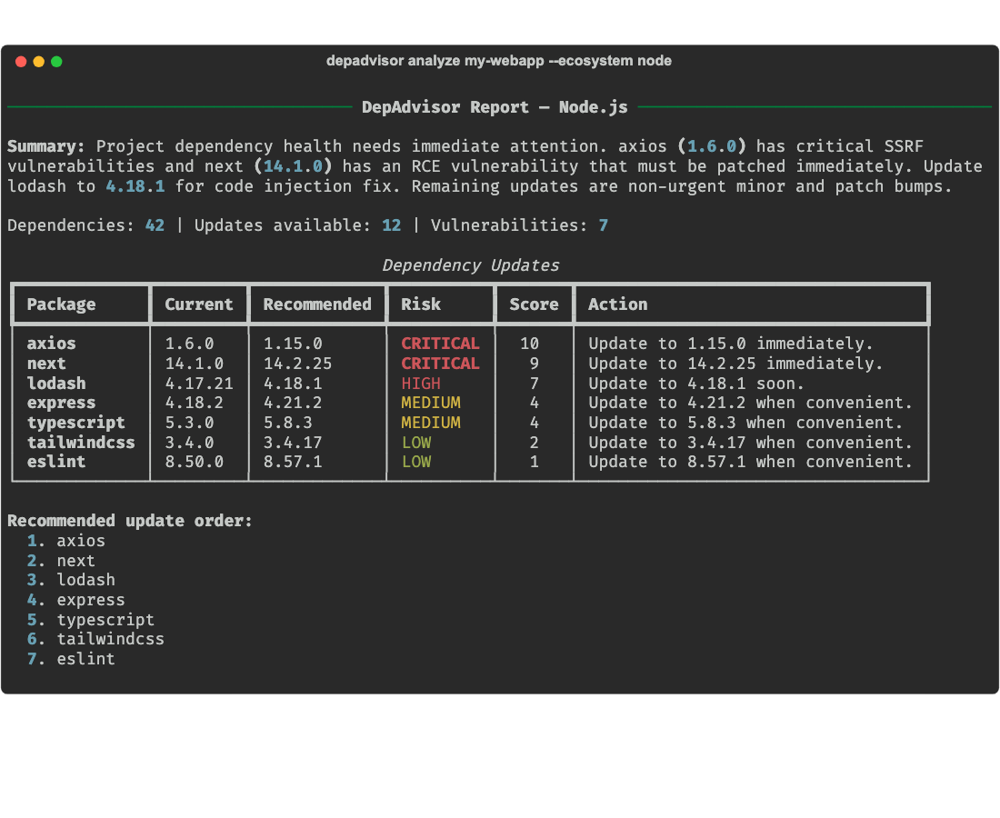
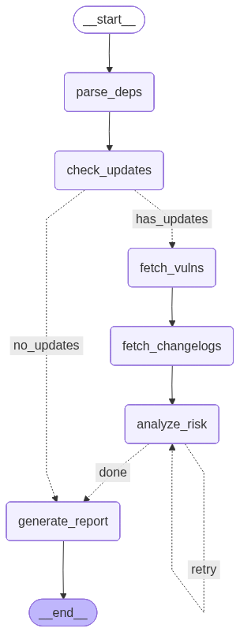

# DepAdvisor

**AI-powered dependency update advisor** — Know *what* to update, *why*, and *in what order*.

[](https://github.com/chaubes/depadvisor/actions/workflows/ci.yml)
[](https://www.python.org/downloads/)
[](LICENSE)

---

DepAdvisor analyzes your project's dependencies, checks for available updates, fetches vulnerability data and changelogs, then uses an LLM to produce **risk-scored, prioritized update recommendations**.

Unlike Dependabot or Renovate which tell you *that* updates exist, DepAdvisor tells you *why you should or shouldn't update*, *what will break*, and *in what order to proceed*.



## Features

- **Multi-ecosystem**: Python (pip/poetry), Node.js (npm), Java (Maven)
- **Risk scoring**: Each update gets a 1-10 risk score with plain English explanation
- **Vulnerability aware**: Integrates with OSV.dev for known CVE detection
- **Changelog analysis**: Fetches GitHub release notes to identify breaking changes
- **Local-first**: Runs entirely locally with Ollama — no API keys needed
- **Cloud LLM support**: Optional OpenAI integration for faster analysis
- **Multiple outputs**: Terminal (Rich), Markdown, JSON, GitHub comment format
- **CI/CD ready**: `--fail-on critical` exits with code 1 for pipeline gating
- **HTTP API**: FastAPI server mode for team dashboards and integrations

## Quick Start

### Install

```bash
pip install depadvisor
```

Or with [UV](https://docs.astral.sh/uv/):

```bash
uv tool install depadvisor
```

### Install Ollama (for local LLM)

```bash
# macOS
brew install ollama

# Linux
curl -fsSL https://ollama.com/install.sh | sh

# Download the model
ollama pull qwen3:8b
```

### Run

```bash
# Analyze current directory
depadvisor analyze .

# Analyze a specific project with options
depadvisor analyze ./my-project --ecosystem python --format markdown

# Analyze a remote git repository (cloned automatically, cleaned up after)
depadvisor analyze https://github.com/pallets/flask.git -v

# Quick vulnerability scan (no LLM needed) — works with local paths and git URLs
depadvisor scan .
depadvisor scan https://github.com/expressjs/express.git

# Use OpenAI instead of local Ollama
depadvisor analyze . --llm openai/gpt-4o-mini
```

## CLI Reference

### `depadvisor analyze`

Run a full dependency analysis with LLM-powered risk assessment. Accepts local paths or git URLs (HTTPS/SSH).

```
Usage: depadvisor analyze [PATH] [OPTIONS]

Arguments:
  PATH                    Local path or git URL of the project [default: .]

Options:
  -e, --ecosystem TEXT    Force ecosystem: python, node, java (auto-detected)
  -l, --llm TEXT          LLM provider/model (default: ollama/qwen3:8b)
  -f, --format TEXT       Output: terminal, markdown, json, github-comment
  -o, --output TEXT       Write to file instead of stdout
  --fail-on TEXT          Exit code 1 if risk level found: critical, high, medium
  --include-dev           Include dev dependencies
  -v, --verbose           Show detailed progress
```

### `depadvisor scan`

Quick vulnerability-only scan. No LLM required. Accepts local paths or git URLs.

```
Usage: depadvisor scan [PATH] [OPTIONS]

Arguments:
  PATH                    Local path or git URL of the project [default: .]

Options:
  -e, --ecosystem TEXT    Force ecosystem: python, node, java
```

### `depadvisor serve`

Start the HTTP API server.

```
Usage: depadvisor serve [OPTIONS]

Options:
  -h, --host TEXT         Host to bind to [default: 0.0.0.0]
  -p, --port INT          Port [default: 8888]
```

## Supported Ecosystems

| Ecosystem | Dependency Files | Registry |
|-----------|-----------------|----------|
| Python | `requirements.txt`, `pyproject.toml` (PEP 621 + Poetry) | PyPI |
| Node.js | `package.json` | npm |
| Java | `pom.xml` | Maven Central |

## Architecture



The agent pipeline flows through six nodes with conditional routing:

- **parse_deps** — Reads dependency files from the project
- **check_updates** — Queries package registries (PyPI, npm, Maven Central)
- **fetch_vulns** — Checks OSV.dev for known vulnerabilities
- **fetch_changelogs** — Fetches release notes from GitHub
- **analyze_risk** — LLM scores each update for risk (with retry on failure)
- **generate_report** — LLM generates a prioritized summary

If no updates are found, the pipeline skips directly to report generation.

Built with [LangGraph](https://github.com/langchain-ai/langgraph) for agent orchestration.

## Configuration

### Environment Variables

| Variable | Description | Default |
|----------|-------------|---------|
| `DEPADVISOR_LLM_PROVIDER` | LLM provider | `ollama` |
| `DEPADVISOR_LLM_MODEL` | LLM model name | `qwen3:8b` |
| `OLLAMA_BASE_URL` | Ollama server URL (for remote Ollama) | `http://localhost:11434` |
| `OPENAI_API_KEY` | OpenAI API key (if using OpenAI) | - |
| `GITHUB_TOKEN` | GitHub token for higher API rate limits | - |
| `DEPADVISOR_CACHE_DIR` | Cache directory | `~/.cache/depadvisor` |
| `LANGSMITH_TRACING` | Enable LangSmith tracing (optional) | - |
| `LANGSMITH_API_KEY` | LangSmith API key (optional) | - |
| `LANGSMITH_PROJECT` | LangSmith project name (optional) | - |
| `LANGSMITH_ENDPOINT` | LangSmith API endpoint (optional) | `https://api.smith.langchain.com` |

> **LangSmith tracing:** If `LANGSMITH_TRACING=true` and `LANGSMITH_API_KEY` are set, all LangGraph agent runs are automatically traced in [LangSmith](https://smith.langchain.com/). Each run is tagged with the ecosystem, LLM provider, and project name for easy filtering. No code changes needed — just set the environment variables.

### CI/CD Integration

```yaml
# .github/workflows/dependency-review.yml
name: Dependency Review
on:
  schedule:
    - cron: '0 9 * * 1'  # Weekly on Monday 9am

jobs:
  review:
    runs-on: ubuntu-latest
    steps:
      - uses: actions/checkout@v4
      - run: pip install depadvisor
      - run: |
          depadvisor analyze . \
            --llm openai/gpt-4o-mini \
            --format github-comment \
            --output report.md \
            --fail-on critical
        env:
          OPENAI_API_KEY: ${{ secrets.OPENAI_API_KEY }}
```

## HTTP API

```bash
# Start server
depadvisor serve --port 8888

# Analyze a project
curl -X POST http://localhost:8888/api/v1/analyze \
  -H "Content-Type: application/json" \
  -d '{"project_path": "/path/to/project", "ecosystem": "python"}'

# Health check
curl http://localhost:8888/health
```

## Development

```bash
git clone https://github.com/chaubes/depadvisor.git
cd depadvisor
uv sync --all-extras

# Run tests
make test-unit
make test-integration

# Lint
make lint

# Run the CLI
make run ARGS="analyze tests/fixtures/python"
```

See [CONTRIBUTING.md](CONTRIBUTING.md) for the full development guide.

## License

MIT License. See [LICENSE](LICENSE).
